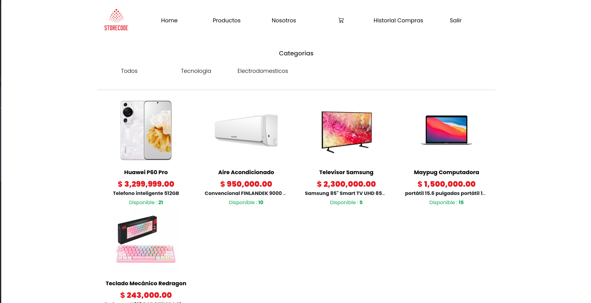
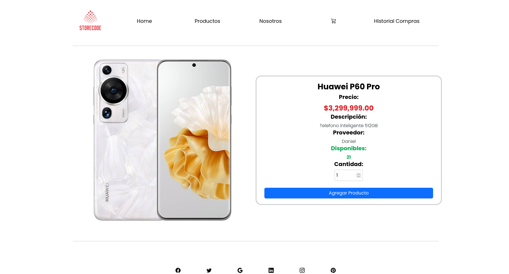

# Sistema de Tienda en Línea con Categorías y Productos Más Vendidos




## Descripción General
Storecode es una tienda virtual desarrollada en Java con Spring Boot, que permite a los usuarios comprar productos organizados por categorías, gestionar un carrito de compras, realizar compras y consultar su historial. El sistema cuenta con roles de usuario (Cliente, Empleado, Administrador) y funcionalidades administrativas para la gestión de productos, categorías, proveedores y usuarios.

## Estructura del Proyecto
- **Backend:** Java 17, Spring Boot 3.1.3, Spring MVC, Spring Data JPA, Thymeleaf.
- **Frontend:** Plantillas Thymeleaf (HTML, Bootstrap 5).
- **Base de datos:** MySQL.
- **Gestión de imágenes:** Cloudinary.
- **Exportación de compras:** PDF (iText).

```
ProyectoEcommerce/
├── src/main/java/com/storecode/
│   ├── controllers/    # Controladores web (productos, usuarios, compras, carrito, categorías, proveedores, PDF)
│   ├── models/         # Entidades JPA (User, Product, Category, Provider, ShoppingCart, Purchase, etc.)
│   ├── repositories/   # Repositorios JPA
│   ├── services/       # Lógica de negocio
│   └── util/           # Utilidades (PDF, Cloudinary)
├── src/main/resources/
│   ├── templates/      # Vistas Thymeleaf (HTML)
│   ├── static/         # Recursos estáticos (CSS, imágenes)
│   └── application.properties # Configuración
├── pom.xml             # Dependencias Maven
├── cap1.png, cap2.png, cap3.png # Capturas de la app
└── README.md
```

## Dependencias Principales
- Spring Boot Starter Web, Data JPA, Thymeleaf, Validation
- MySQL Connector/J
- Cloudinary (gestión de imágenes)
- iText (PDF)

## Instalación y Configuración
1. **Clona el repositorio:**
   ```bash
   git clone <url-del-repositorio>
   cd ProyectoEcommerce
   ```
2. **Configura la base de datos MySQL:**
   - Crea una base de datos llamada `storecodedb`.
   - Modifica las credenciales en `src/main/resources/application.properties` si es necesario:
     ```properties
     spring.datasource.url=jdbc:mysql://localhost:3306/storecodedb
     spring.datasource.username=root
     spring.datasource.password=root
     ```
3. **Configura Cloudinary:**
   - Completa los valores de `cloud.name`, `cloud.key` y `cloud.secret` en `application.properties`.
4. **Instala dependencias y compila:**
   ```bash
   ./mvnw clean install
   ```

## Ejecución
Puedes ejecutar la aplicación con:
```bash
./mvnw spring-boot:run
```
La aplicación estará disponible en [http://localhost:8080](http://localhost:8080)

## Funcionalidades Principales
- **Catálogo de productos:** Visualización por categorías, productos más vendidos, detalle de producto.
- **Carrito de compras:** Agregar, quitar, modificar cantidades, confirmar pedido.
- **Gestión de usuarios:** Registro, login, edición, roles (Cliente, Empleado, Administrador).
- **Gestión administrativa:**
  - Productos: CRUD, carga de imágenes (Cloudinary)
  - Categorías: CRUD
  - Proveedores: CRUD
  - Usuarios: CRUD
- **Historial de compras:** Visualización y descarga de facturas en PDF.
- **Responsive:** Interfaz adaptada a dispositivos móviles y escritorio.

## Vistas principales
- Página de inicio con carrusel de productos destacados.
- Listado de productos filtrable por categoría.
- Carrito de compras interactivo.
- Historial de compras y descarga de facturas.
- Paneles administrativos para gestión de inventario, usuarios y proveedores.

## Autores
- Juan Manuel Arenas Rincón
- Hamilton Damian López
- Daniela Villalba Torres